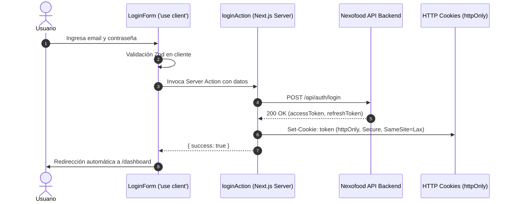

# Plan de Implementación de la API — Nexofood

Este documento detalla la estrategia de arquitectura, integración y despliegue para conectar el frontend de **Nexofood** (Next.js 16 + React 19 + Tailwind CSS) con la API REST proyectada en [API_DOCUMENTATION.md](./document/API_DOCUMENTATION.md).

---

## 1. Visión General de Arquitectura

El sistema se diseñará bajo un modelo híbrido aprovechando las capacidades completas de **Next.js App Router**:

- **Next.js Server Side (Server Components, Server Actions, Route Handlers, Middleware):**
  - **Carga pesada y analíticas:** Agregaciones de métricas, reportes de ventas, gráficos y KPIs sin sobrecargar el JavaScript del cliente.
  - **Seguridad & Sesiones:** Manejo de tokens JWT en cookies `httpOnly`, renovación de tokens (`refresh token`), middleware de protección de rutas privadas del SaaS.
  - **SEO y Performance:** Server Components para renderizado inicial de catálogos y menús públicos con soporte de caché (`fetch` con tags de revalidación).
  - **BFF (Backend-For-Frontend):** Route Handlers opcionales para sanitizar o adaptar peticiones antes de contactar el backend si fuese necesario.

- **React Client Side (`'use client'`):**
  - **Interactividad inmediata:** Formularios reactivos (Login, Registro, Modales de creación de productos).
  - **Estado global volátil:** Carrito de compras (`src/stores/cart-store.ts` con Zustand) para retroalimentación instantánea al cliente.
  - **Visualización dinámica:** Componentes de gráficos interactivos (Recharts / Chart.js) que reciben datos limpios precalculados por el servidor.
  - **Experiencia de usuario UI:** Drawers, modales, menús desplegables, debounced search y filtrado local.

---

## 2. Separación Arquitectónica de Carpetas: Landing vs SaaS

Para mantener el código ordenado, modular y escalable, se implementa una separación con **Route Groups** de Next.js en `src/app/` y una arquitectura orientada a características (*Feature-based*) en `src/modules/` o `src/features/`.

### Estructura de Directorios Recomendada:

```text
nexofood/
├── docs/
│   ├── design/
│   ├── document/
│   └── api_implementation_plan.md
├── src/
│   ├── app/                                # Enrutamiento Next.js App Router
│   │   ├── (landing)/                      # Grupo de rutas para la Landing Pública
│   │   │   ├── layout.tsx                  # Layout con Header público y Footer
│   │   │   └── page.tsx                    # Landing actual
│   │   ├── (auth)/                         # Flujo de autenticación
│   │   │   ├── layout.tsx                  # Layout limpio y centrado para login/registro
│   │   │   ├── login/
│   │   │   │   └── page.tsx
│   │   │   └── register/
│   │   │       └── page.tsx
│   │   ├── (saas)/                         # Plataforma SaaS (Protegida)
│   │   │   ├── layout.tsx                  # Layout del SaaS con Sidebar, Header de usuario y guard de sesión
│   │   │   ├── dashboard/                  # Panel principal y gráficos pesados
│   │   │   │   └── page.tsx
│   │   │   ├── catalog/                    # Gestión de categorías y productos
│   │   │   │   ├── page.tsx
│   │   │   │   └── [id]/page.tsx
│   │   │   ├── orders/                     # Control de pedidos y comandas
│   │   │   │   └── page.tsx
│   │   │   └── settings/                   # Configuración del restaurante / usuario
│   │   │       └── page.tsx
│   │   ├── api/                            # Route Handlers opcionales (Proxy BFF / Webhooks)
│   │   │   └── auth/[...nextauth]/route.ts (o custom proxy)
│   │   ├── globals.css
│   │   └── layout.tsx                      # Layout raíz (Fuentes, Providers globales)
│   │
│   ├── modules/                            # Lógica de negocio y vistas por módulo
│   │   ├── landing/                        # Componentes exclusivos de la landing
│   │   │   ├── components/                 # Hero, Features, ImpactStats, Pricing, etc.
│   │   │   └── ...
│   │   ├── auth/                           # Lógica de autenticación
│   │   │   ├── components/                 # LoginForm, RegisterForm
│   │   │   ├── actions/                    # Server Actions: loginAction, registerAction
│   │   │   └── schemas/                    # Zod schemas: loginSchema, registerSchema
│   │   ├── saas/                           # Componentes y lógica del SaaS
│   │   │   ├── layout/                     # Sidebar, Topbar, UserMenu, Breadcrumbs
│   │   │   ├── analytics/                  # Componentes de gráficos y métricas
│   │   │   ├── catalog/                    # Formularios de producto, modales de categoría
│   │   │   └── orders/                     # Tablas de órdenes, badges de estado
│   │   └── cart/                           # Lógica del carrito
│   │       ├── store/                      # Zustand useCartStore
│   │       └── components/                 # CartDrawer, CartSummary
│   │
│   ├── components/                         # Componentes UI globales y atómicos
│   │   └── ui/                             # Button, Input, Modal, Table, Card, Icon, etc.
│   │
│   ├── lib/                                # Utilidades y clientes HTTP
│   │   ├── api-client.ts                   # Fetch wrapper tipado con manejo de tokens y errores
│   │   ├── auth.ts                         # Helpers para leer y verificar sesiones en servidor
│   │   └── utils.ts                        # Helpers de formato de moneda, fechas, etc.
│   │
│   ├── schemas/                            # Tipos y esquemas Zod compartidos (DTOs)
│   │   ├── auth.dto.ts
│   │   ├── catalog.dto.ts
│   │   ├── cart.dto.ts
│   │   └── order.dto.ts
│   │
│   ├── stores/                             # Stores de Zustand compartidos (si aplica)
│   └── middleware.ts                       # Interceptor para proteger rutas /dashboard y redirigir a /login
```

---

## 3. Matriz de Responsabilidades: React (Client) vs Next.js (Server)

| Módulo / Funcionalidad | Capa | Tecnología | Justificación Técnica |
| :--- | :--- | :--- | :--- |
| **Landing Page** | Server + Client | Next.js RSC + 'use client' | Estructura estática renderizada en servidor; 'use client' solo para interactividad (menú móvil, acordeones). |
| **Métricas & Gráficos SaaS** | **Next.js Server Side** | Server Component + Aggregation | Las consultas masivas de ventas, sumatorias y reportes se calculan en el servidor para no enviar arrays pesados al cliente ni exponer lógica de negocio. |
| **Renderizado Gráfico Visual** | **React Client Side** | `'use client'` (Recharts/Chart.js) | Las librerías de gráficos requieren manipulación de Canvas/SVG y eventos de ratón (`hover`, `tooltip`, animaciones). Reciben solo el resultado procesado. |
| **Formularios (Login/Registro)** | **React Client Side** | `'use client'` + React Hook Form + Zod | Validación en tiempo real campo a campo, feedback visual inmediato, estados de carga y errores de validación. |
| **Mutación de Auth** | **Next.js Server Side** | Server Action | Guarda las credenciales `accessToken` y `refreshToken` en cookies `httpOnly` seguras, evitando ataques XSS. |
| **Protección de Rutas (`/dashboard`)** | **Next.js Server Side** | `middleware.ts` | Valida el token o cookie de sesión antes de que la página o componentes se envíen al navegador. Redirige a `/login` si no está autenticado. |
| **Carrito de Compras (Local)** | **React Client Side** | Zustand Store (`useCartStore`) | Respuesta instantánea al usuario: añadir producto, incrementar cantidad, cálculo de subtotal sin latencia de red. |
| **Sincronización de Carrito** | Next.js Server Side / BFF | Server Action / API Handler | Envía `POST /api/cart/items` en background para persistir el carrito del cliente en el backend. |
| **Listado de Catálogo (SaaS)** | **Next.js Server Side** | Server Component (SSR / ISR) | Obtiene productos y categorías con `fetch(..., { next: { tags: ['products'] } })` directamente en el servidor, sin waterfalls en el cliente. |
| **Filtros y Búsqueda en Tablas** | **React Client Side** | `'use client'` + URL SearchParams | Interacción fluida al buscar por texto o filtrar estados usando debounce y actualizando la URL de forma síncrona. |
| **Exportación de Reportes (PDF/Excel)**| **Next.js Server Side** | Route Handler (`/api/reports/...`) | Generación en streaming o buffer en el servidor sin colgar la memoria del navegador. |

---

## 4. Estrategia de Conexión y Gestión de Estado de la API

### 4.1. Esquemas Zod y Contratos DTO (`src/schemas/`)

Mapeo directo de las interfaces documentadas en [API_DOCUMENTATION.md](./document/API_DOCUMENTATION.md):

1. **Autenticación:**
   - `RegisterRequestSchema`: `email`, `password`, `fullName`, `phone`.
   - `AuthResponseSchema`: `accessToken`, `refreshToken`, `tokenType`, `expiresIn`.
   - `UserUpdateSchema` y `CustomerAddressSchema`.
2. **Catálogo:**
   - `CategoryCreateSchema`: `name`, `description`.
   - `ProductCreateSchema`: `categoryId`, `name`, `description`, `price`, `imageUrl`, `isAvailable`.
   - `ProductResponseSchema`.
3. **Carrito:**
   - `CartItemRequestSchema`: `productId`, `quantity`, `notes`.
   - `CartItemResponseSchema`.
4. **Órdenes:**
   - `OrderCreateSchema`: `orderData`, items, montos y direcciones.

### 4.2. Cliente de API Centralizado (`src/lib/api-client.ts`)

Un wrapper universal sobre `fetch` que:
- Inyecta automáticamente el token `Bearer ${token}` (desde cookies en Server Components / Server Actions o desde cabeceras seguras).
- Maneja códigos de error comunes (400 Bad Request, 401 Unauthorized, 403 Forbidden, 404 Not Found, 500 Server Error).
- Auto-renueva el token llamando al endpoint de refresh cuando se recibe un 401.

### 4.3. Flujo de Autenticación y Sesión Segura



---

## 5. Lista de Tareas Detallada para la Implementación (Roadmap)

### Fase 1: Reestructuración de Carpetas y Configuración Base ✅ COMPLETADA
- [x] Crear el grupo de rutas `src/app/(landing)/` y mover allí la página principal y el layout público.
- [x] Reorganizar los componentes actuales de la landing dentro de `src/modules/landing/components/`.
- [x] Actualizar el botón *"Iniciar sesión"* en `Header.tsx` para redirigir a `/login`.
- [x] Crear el grupo de rutas `src/app/(auth)/` con las pantallas `login/page.tsx` y `register/page.tsx`.
- [x] Crear el grupo de rutas `src/app/(saas)/` con su `layout.tsx` (Sidebar de navegación, Topbar y zona de contenido).

### Fase 2: Capa de Tipos, DTOs y Cliente HTTP
- [ ] Configurar variables de entorno (`NEXT_PUBLIC_API_URL` y `API_INTERNAL_URL` en `.env.local`).
- [ ] Implementar los esquemas Zod en `src/schemas/`:
  - [ ] `auth.schema.ts` (Register, Login, UserUpdate, Address).
  - [ ] `catalog.schema.ts` (Category, Product).
  - [ ] `cart.schema.ts` (CartItem, CartResponse).
  - [ ] `order.schema.ts` (OrderCreate, OrderItem).
- [ ] Crear `src/lib/api-client.ts` con manejo unificado de headers, tokens y tipado genérico con validación Zod opcional.
- [ ] Configurar el helper de cookies de servidor para lectura/escritura de sesión en Next.js.

### Fase 3: Módulo de Autenticación y Middleware
- [ ] Crear Server Action `loginAction` y `registerAction` conectadas a `/api/auth/register` y `/api/auth/login`.
- [ ] Implementar el formulario `LoginForm` con React Hook Form + Zod, gestión de estados de error y spinners.
- [ ] Implementar el formulario `RegisterForm`.
- [ ] Crear el `middleware.ts` en la raíz de `src/` para verificar el token de sesión y proteger todas las rutas bajo `/(saas)/...`.
- [ ] Implementar el botón y Server Action de *"Cerrar sesión"*, que elimine las cookies y redirija a `/login`.

### Fase 4: Módulo de Catálogo en el SaaS
- [ ] Crear la página `src/app/(saas)/catalog/page.tsx` como Server Component para cargar la lista de productos y categorías con SSR/revalidación.
- [ ] Crear el modal/formulario interactivo `'use client'` para agregar categorías (`POST /api/catalog/categories`).
- [ ] Crear el formulario `'use client'` para crear productos (`POST /api/catalog/products`) con subida de imagen y validación de precios.
- [ ] Implementar Server Action para revalidar el tag del catálogo (`revalidatePath('/catalog')` o `revalidateTag('catalog')`) tras crear un item.

### Fase 5: Módulo de Carrito y Órdenes
- [ ] Implementar `src/stores/cart-store.ts` con Zustand para almacenar items localmente con persistencia opcional en `localStorage`.
- [ ] Conectar la adición de items con `POST /api/cart/items`.
- [ ] Crear la vista de checkout y conectar la creación de orden con `POST /api/orders`.
- [ ] Crear la vista del SaaS `src/app/(saas)/orders/page.tsx` para visualizar pedidos entrantes y estados.

### Fase 6: Módulo de Dashboard, Gráficos y Métricas Pesadas
- [ ] Diseñar el Server Component `src/app/(saas)/dashboard/page.tsx` que agregue y procese en el servidor los datos de ventas diarias, pedidos completados y ticket promedio.
- [ ] Crear componentes cliente livianos de visualización (ej. `SalesBarChart`, `OrdersDonutChart`) que reciban los datos ya resumidos y formateados vía props.
- [ ] Asegurar que no se transfieran payloads crudos o no procesados al cliente, manteniendo el bundle ligero y el rendimiento óptimo.
